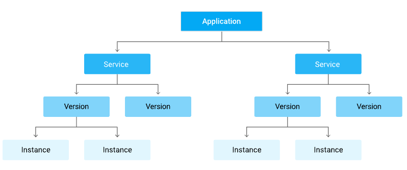

<!--
 Copyright 2021 Google LLC

 Licensed under the Apache License, Version 2.0 (the "License");
 you may not use this file except in compliance with the License.
 You may obtain a copy of the License at

     https://www.apache.org/licenses/LICENSE-2.0

 Unless required by applicable law or agreed to in writing, software
 distributed under the License is distributed on an "AS IS" BASIS,
 WITHOUT WARRANTIES OR CONDITIONS OF ANY KIND, either express or implied.
 See the License for the specific language governing permissions and
 limitations under the License.
-->

# Google App Engine Application Components Documentation

*   [Components of an Application](#components-of-an-application)
*   [Services](#services)
*   [Versions](#versions)
*   [Instances](#instances)
*   [Application Requests](#application-requests)
*   [Logging Application Requests](#logging-application-requests)

## Components of an Application

An App Engine app is made up of a single application resource that consists of
one or more services. Each service can be configured to use different runtimes
and to operate with different performance settings. Within each service, you
deploy versions of that service. Each version then runs within one or more
instances, depending on how much traffic you configured it to handle. Your App
Engine app is created under your Google Cloud project when you create an
application resource. The App Engine application is a top-level container that
includes the service, version, and instance resources that make up your app.
When you create your App Engine app, all your resources are created in the
region that you choose, including your app code along with a collection of
settings, credentials, and your app's metadata. Each App Engine application
includes at least one service, the default service, which can hold many
versions, depending on your app's billing status. The following diagram
illustrates the hierarchy of an App Engine app running with multiple services:

Other Google Cloud services, for example Datastore, are shared across your App
Engine app.

## Services

Use services in App Engine to factor your large apps into logical components
that can securely share App Engine features and communicate with one another.
Generally, your App Engine services behave like microservices. Therefore, you
can run your whole app in a single service or you can design and deploy multiple
services to run as a set of microservices. For example, an app that handles your
customer requests might include separate services that each handle different
tasks, such as: - API requests from mobile devices - Internal,
administration-type requests - Backend processing such as billing pipelines and
data analysis Each service in App Engine consists of the source code from your
app and the corresponding App Engine configuration files. The set of files that
you deploy to a service represent a single version of that service and each time
that you deploy to that service, you are creating additional versions within
that same service.

## Versions

Having multiple versions of your app within each service allows you to quickly
switch between different versions of that app for rollbacks, testing, or other
temporary events. You can route all traffic to a specific version of your app by
migrating traffic or route to multiple versions of your app by splitting
traffic.

## Instances

The versions within your services run on one or more instances. By default, App
Engine scales your app to match the load. Your apps will scale up the number of
instances that are running to provide consistent performance, or scale down to
minimize idle instances and reduces costs.

## Application Requests

Each of your app's services and each of the versions within those services must
have a unique name. You can then use those unique names to target and route
traffic to specific resources using URLs, for example:
`https://VERSION-dot-SERVICE-dot-PROJECT_ID.REGION_ID.r.appspot.com` Incoming
user requests are routed to the services or versions that are configured to
handle traffic. You can also target and route requests to specific services and
versions.

## Logging Application Requests

When your application handles a request, it can also write its own logging
messages to stdout and stderr.
